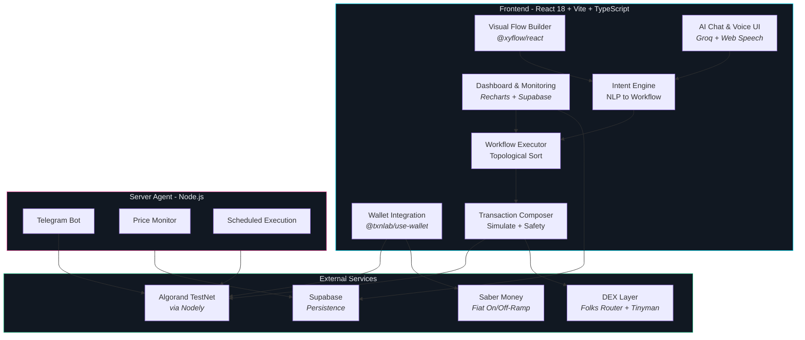

<p align="center">
  
</p>

<h1 align="center">Zuik</h1>

<p align="center">
  <strong>Intent-Based DeFi Automation on Algorand</strong>
</p>

<p align="center">
  
  
  
  
  
</p>

<p align="center">
  <code>voice</code> · <code>text</code> · <code>drag & drop</code> · <code>AI-powered</code> · <code>non-custodial</code> · <code>atomic execution</code>
</p>

<p align="center">
  Describe what you want in plain language, draw it with visual blocks, or speak it out loud.<br/>
  Zuik builds the workflow and executes it on Algorand  - all-or-nothing, sub-5s finality.
</p>

---

## How It Works


> **Step 1** - Describe your intent via voice, text, or by dragging blocks onto the canvas.
> **Step 2** - Zuik simulates the workflow: fee breakdown, slippage estimates, safety warnings.
> **Step 3** - Sign once. Atomic transaction groups execute on Algorand with sub-5s finality.

---

## Features

| | Feature | What It Does |
|-|---------|-------------|
| **AI** | Intent Engine | Describe trades in plain English; AI generates the full workflow. Powered by Groq (Llama 3.3 70B). |
| **Voice** | Enhanced Conversation (Phase 7B ✨) | Production-grade voice with server-side Groq Whisper + ElevenLabs TTS. Multi-language (Hindi/English) support. |
| **Visual** | Flow Builder | 30+ drag-and-drop blocks across triggers, actions, logic, notifications, and DeFi. |
| **Safety** | Transaction Simulation | Every workflow is simulated before signing. See fees, slippage, and warnings upfront. |
| **Execution** | Atomic Groups | All-or-nothing transaction groups. If any step fails, everything rolls back. |
| **Alerts** | Cloud-Ready Agent (Phase 7C ✨) | Production Telegram bot with webhook mode, deployed on Railway.app or Render.com. |
| **Fiat** | On/Off-Ramp | Buy crypto with INR/USD/EUR or cash out to your bank via Saber Money. |

---

## Architecture



---

## Quick Start

### Prerequisites

| Tool | Install |
|------|---------|
| **Node.js** 20+ | [nodejs.org](https://nodejs.org) |
| **npm** 9+ | Comes with Node.js |

### 1. Clone and install frontend

```bash
git clone https://github.com/DarshanKrishna-DK/Zuik.git
cd Zuik/projects/Zuik-frontend
npm install
```

### 2. Configure environment

```bash
cp .env.template .env
```

Open `.env` and fill in your keys:

| Variable | Source |
|----------|--------|
| `VITE_GROQ_API_KEY` | Free at [console.groq.com/keys](https://console.groq.com/keys) |
| `VITE_SUPABASE_URL` | Free at [supabase.com](https://supabase.com) |
| `VITE_SUPABASE_ANON_KEY` | Supabase project settings |
| `VITE_SABER_CLIENT_ID` | From Saber Money (optional - for fiat ramp) |
| `saber-sign` Edge Function secrets | Set `SABER_CLIENT_ID` and `SABER_CLIENT_SECRET` in Supabase (Dashboard - Edge Functions) after `supabase functions deploy saber-sign` |
| `VITE_TELEGRAM_BOT_TOKEN` | Via [@BotFather](https://t.me/BotFather) (optional) |
| `VITE_VOICE_SERVER_URL` | Voice processing server (Phase 7B) - `http://localhost:3002` for local dev |

> Algorand TestNet node URLs are pre-configured via [Nodely](https://nodely.io) free tier. No changes needed.

### 3. Start the frontend

```bash
npm run dev
```

Open **[http://localhost:5173](http://localhost:5173)** and connect your wallet (Pera, Defly, or Exodus) on **Algorand TestNet**.

> Free TestNet ALGO: [Algorand Dispenser](https://dispenser.testnet.aws.algodev.network/)

### 4. Start the server agent (optional)

The server agent handles background tasks: Telegram bot, price monitoring, scheduled workflow execution.

```bash
cd server
npm install
cp .env.example .env
```

Fill in `server/.env`:

| Variable | Source |
|----------|--------|
| `SUPABASE_URL` | Same as frontend |
| `SUPABASE_SERVICE_KEY` | Supabase project settings (service role key) |
| `TELEGRAM_BOT_TOKEN` | Same token as frontend |
| `GROQ_API_KEY` | Same key as frontend |

```bash
npm start
```

---

## Tech Stack

| Layer | Technology |
|-------|-----------|
| **Blockchain** | Algorand TestNet via [Nodely](https://nodely.io) |
| **Frontend** | React 18, Vite 5, TypeScript |
| **Flow Editor** | [@xyflow/react](https://reactflow.dev) v12 |
| **Wallet** | [@txnlab/use-wallet](https://github.com/TxnLab/use-wallet) |
| **AI Engine** | [Groq](https://groq.com)  - Llama 3.3 70B |
| **Voice** | Web Speech API |
| **DEX** | [Folks Router](https://folksrouter.io) + [Tinyman](https://tinyman.org) |
| **Fiat** | [Saber Money](https://docs.saber.money) |
| **Database** | [Supabase](https://supabase.com) |
| **Notifications** | Telegram Bot API + Discord |
| **Server** | Node.js + tsx |

---

## Project Structure

```
Zuik/
├── projects/Zuik-frontend/          React + Vite + React Flow
│   ├── src/
│   │   ├── components/flow/         GenericNode, Sidebar, ChatPanel, etc.
│   │   ├── lib/                     Block registry, executors, intent materializer
│   │   ├── services/                Algorand txns, DEX, AI parser, Supabase
│   │   ├── pages/                   Landing, Builder, Dashboard, Settings
│   │   └── styles/                  Global CSS with design tokens
│   └── public/
├── server/                          Node.js agent (Telegram, price monitor)
├── docs/                            Architecture diagrams
└── ZUIK_DEVELOPMENT_PLAN.md         Development roadmap
```

---

## License

This project is licensed under the [MIT License](LICENSE).

---

<p align="center">
  <strong>Built for <a href="https://www.algohackseries.com/">AlgoHackSeries 3.0</a></strong><br/>
  <sub>Intent-Based DeFi Automation on Algorand</sub>
</p>
