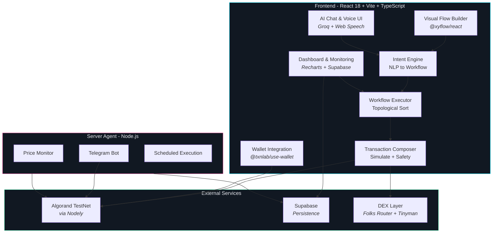

<p align="center">
  
</p>

<h1 align="center">Zuik</h1>

<p align="center">
  <strong>Intent-Based DeFi Automation on Algorand</strong>
</p>

<p align="center">
  
  
  
  
  
</p>

<p align="center">
  <code>voice</code> · <code>text</code> · <code>drag & drop</code> · <code>AI-powered</code> · <code>non-custodial</code> · <code>atomic execution</code>
</p>

<p align="center">
  Describe what you want in plain language, draw it with visual blocks, or speak it out loud.<br/>
  Zuik builds the workflow and executes it on Algorand  - all-or-nothing, sub-5s finality.
</p>

---

## How It Works


```mermaid
flowchart LR
    subgraph INPUT["  1 - Describe  "]
        direction TB
        V["Voice"]
        T["Text"]
        D["Drag & Drop"]
    end

    subgraph REVIEW["  2 - Review  "]
        direction TB
        SIM["Simulate Fees"]
        SAFE["Safety Checks"]
        SLIP["Slippage Warning"]
    end

    subgraph EXECUTE["  3 - Execute  "]
        direction TB
        SIGN["Wallet Signs"]
        ATOMIC["Atomic Txn Group"]
        CONFIRM["On-chain Confirm"]
    end

    INPUT -- "AI Intent Engine" --> REVIEW
    REVIEW -- "Approve & Sign" --> EXECUTE

    style INPUT fill:#1a1040,stroke:#a78bfa,color:#e8eaf0
    style REVIEW fill:#0a1a2a,stroke:#00e5ff,color:#e8eaf0
    style EXECUTE fill:#0a2018,stroke:#34d399,color:#e8eaf0
```

> **Step 1** - Describe your intent via voice, text, or by dragging blocks onto the canvas.
> **Step 2** - Zuik simulates the workflow: fee breakdown, slippage estimates, safety warnings.
> **Step 3** - Sign once. Atomic transaction groups execute on Algorand with sub-5s finality.

---

## Features

| | Feature | What It Does |
|-|---------|-------------|
| **AI** | Intent Engine | Describe trades in plain English; AI generates the full workflow. Powered by Groq (Llama 3.3 70B). |
| **Voice** | Enhanced Conversation ✨ | Production-grade voice with server-side Groq Whisper + ElevenLabs TTS. Multi-language (Hindi/English) support. |
| **Multi-Agent** | Orchestration 🚀 | Multi-trigger workflows with merge gates, fork/join blocks, and event-driven automation. |
| **Cloud Agent** | 24/7 Execution 🌐 | Deploy persistent agents to Railway.app for continuous workflow monitoring and execution. |
| **Visual** | Flow Builder | 30+ drag-and-drop blocks across triggers, actions, logic, notifications, and DeFi. |
| **Safety** | Transaction Simulation | Every workflow is simulated before signing. See fees, slippage, and warnings upfront. |
| **Execution** | Atomic Groups | All-or-nothing transaction groups. If any step fails, everything rolls back. |
| **Alerts** | Cloud-Ready Agent (Phase 7C ✨) | Production Telegram bot with webhook mode, deployed on Railway.app or Render.com. |

---

## Architecture


```mermaid
graph TB
    subgraph FRONTEND["Frontend - React 18 + Vite + TypeScript"]
        FB["Visual Flow Builder<br/><i>@xyflow/react</i>"]
        AI["AI Chat & Voice UI<br/><i>Groq + Web Speech</i>"]
        DASH["Dashboard & Monitoring<br/><i>Recharts + Supabase</i>"]
        WALLET["Wallet Integration<br/><i>@txnlab/use-wallet</i>"]

        IE["Intent Engine<br/>NLP to Workflow"]
        WE["Workflow Executor<br/>Topological Sort"]
        TC["Transaction Composer<br/>Simulate + Safety"]

        FB --> IE
        AI --> IE
        IE --> WE
        WE --> TC
        DASH --> WE
    end

    subgraph EXTERNAL["External Services"]
        ALGO["Algorand TestNet<br/><i>via Nodely</i>"]
        SUPA["Supabase<br/><i>Persistence</i>"]
        DEX["DEX Layer<br/><i>Folks Router + Tinyman</i>"]
    end

    subgraph SERVER["Server Agent - Node.js"]
        TBOT["Telegram Bot"]
        PRICE["Price Monitor"]
        SCHED["Scheduled Execution"]
    end

    TC --> ALGO
    TC --> DEX
    WALLET --> ALGO
    DASH --> SUPA
    SERVER --> SUPA
    SERVER --> ALGO
    TBOT --> ALGO

    style FRONTEND fill:#111822,stroke:#00e5ff,color:#e8eaf0
    style EXTERNAL fill:#111822,stroke:#34d399,color:#e8eaf0
    style SERVER fill:#111822,stroke:#ec4899,color:#e8eaf0
```

---

## Quick Start

### Prerequisites

| Tool | Install | Purpose |
|------|---------|---------|
| **Node.js** 20+ | [nodejs.org](https://nodejs.org) | Frontend development |
| **npm** 9+ | Comes with Node.js | Package management |
| **Railway CLI** | [railway.app/cli](https://docs.railway.app/develop/cli) | Cloud deployment (optional) |

### 1. Clone and install frontend

```bash
git clone https://github.com/DarshanKrishna-DK/Zuik.git
cd Zuik/projects/Zuik-frontend
npm install
```

### 2. Configure environment

```bash
cp .env.template .env
```

Open `.env` and fill in your keys:

| Variable | Source | Required |
|----------|--------|----------|
| `VITE_GROQ_API_KEY` | Free at [console.groq.com/keys](https://console.groq.com/keys) | ✅ Core AI |
| `VITE_SUPABASE_URL` | Free at [supabase.com](https://supabase.com) | ✅ Database |
| `VITE_SUPABASE_ANON_KEY` | Supabase project settings | ✅ Database |
| `VITE_VOICE_SERVER_URL` | Your Railway deployment URL | ⭕ Enhanced voice |
| `VITE_TELEGRAM_BOT_TOKEN` | Via [@BotFather](https://t.me/BotFather) | ⭕ Telegram bot |

> Algorand TestNet node URLs are pre-configured via [Nodely](https://nodely.io) free tier. No changes needed.

### 3. Start the frontend

```bash
npm run dev
```

Open **[http://localhost:5173](http://localhost:5173)** and connect your wallet (Pera, Defly, or Exodus) on **Algorand TestNet**.

> 💡 **Get Free TestNet ALGO:** [Algorand Dispenser](https://dispenser.testnet.aws.algodev.network/)

### 4. Deploy cloud agent (for 24/7 automation)

The cloud agent enables persistent workflow execution, voice processing, and Telegram integration.

#### Option A: Deploy to Railway.app (Recommended)

```bash
cd projects/server
railway login
railway init
railway up
```

#### Option B: Run locally (Development only)

```bash
cd projects/server
npm install
cp .env.example .env
npm run dev
```

Configure your deployment environment:

| Variable | Source | Purpose |
|----------|--------|---------|
| `SUPABASE_URL` | Same as frontend | Database connection |
| `SUPABASE_SERVICE_KEY` | Supabase project settings (service role key) | Database admin access |
| `TELEGRAM_BOT_TOKEN` | [@BotFather](https://t.me/BotFather) | Telegram bot integration |
| `GROQ_API_KEY` | [console.groq.com/keys](https://console.groq.com/keys) | AI + voice processing |
| `ELEVENLABS_API_KEY` | [elevenlabs.io](https://elevenlabs.io) | High-quality TTS |
| `TELEGRAM_WEBHOOK_URL` | Your Railway app URL + `/telegram/webhook` | Telegram webhook mode |
| `PORT` | Automatically set by Railway | Server port |

**Start the agent:**

```bash
npm start  # Production mode (Railway)
npm run dev  # Development mode (local)
```

> 📚 **Detailed deployment guide:** See `reference_docs/RAILWAY_DEPLOYMENT_GUIDE.md`

---

## Tech Stack

| Layer | Technology |
|-------|-----------|
| **Blockchain** | Algorand TestNet via [Nodely](https://nodely.io) |
| **Frontend** | React 18, Vite 5, TypeScript |
| **Flow Editor** | [@xyflow/react](https://reactflow.dev) v12 |
| **Wallet** | [@txnlab/use-wallet](https://github.com/TxnLab/use-wallet) |
| **AI Engine** | [Groq](https://groq.com)  - Llama 3.3 70B |
| **Voice** | Web Speech API |
| **DEX** | [Folks Router](https://folksrouter.io) + [Tinyman](https://tinyman.org) |
| **Database** | [Supabase](https://supabase.com) |
| **Notifications** | Telegram Bot API + Discord |
| **Server** | Node.js + tsx |

---

## Project Structure

```
Zuik/
├── projects/Zuik-frontend/          React + Vite + React Flow
│   ├── src/
│   │   ├── components/flow/         GenericNode, Sidebar, ChatPanel, etc.
│   │   ├── lib/                     Block registry, executors, intent materializer
│   │   ├── services/                Algorand txns, DEX, AI parser, Supabase
│   │   ├── pages/                   Landing, Builder, Dashboard, Settings
│   │   └── styles/                  Global CSS with design tokens
│   └── public/
├── projects/server/                 Node.js agent (Telegram, price monitor)
├── docs/                            Architecture diagrams
└── ZUIK_DEVELOPMENT_PLAN.md         Development roadmap
```

---

## License

This project is licensed under the [MIT License](LICENSE).

---

<p align="center">
  <strong>Built for <a href="https://www.algohackseries.com/">AlgoHackSeries 3.0</a></strong><br/>
  <sub>Intent-Based DeFi Automation on Algorand</sub>
</p>
