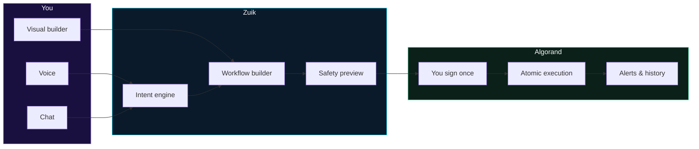
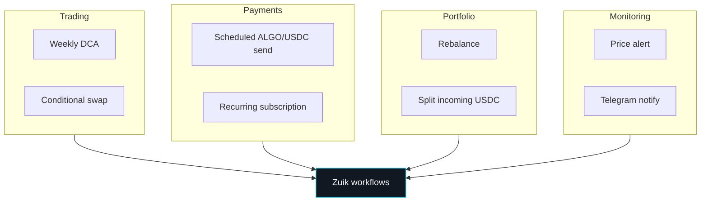
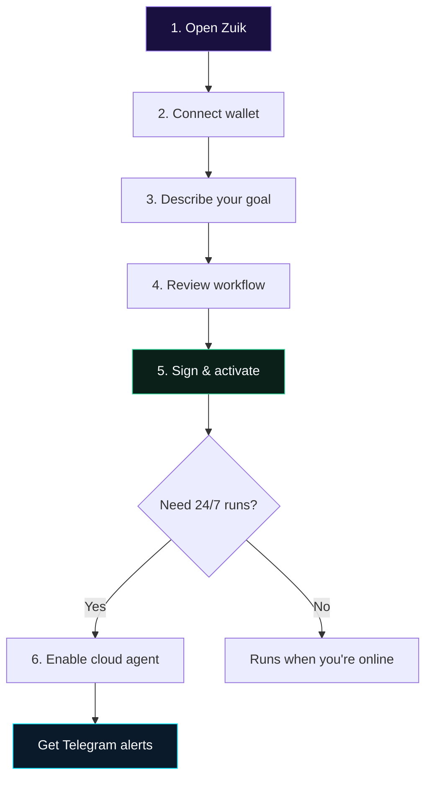
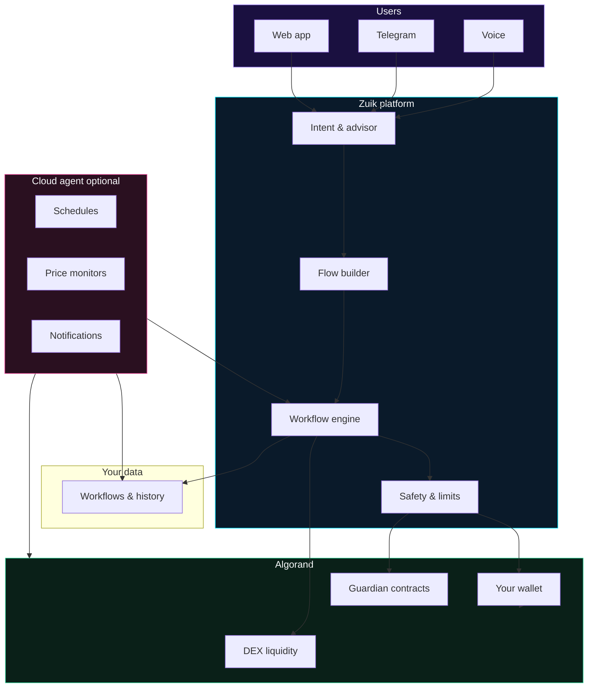

<p align="center">
  
</p>

<h1 align="center">Zuik</h1>

<p align="center">
  <strong>DeFi automation you can describe in plain language</strong>
</p>

<p align="center">
  
  
  
  
</p>

<p align="center">
  Set up a <strong>$500 weekly DCA into ALGO</strong>, alert yourself when prices move, or rebalance your portfolio -<br/>
  by speaking, typing, or arranging a simple visual flow. Zuik builds the automation; you stay in control with one approval.
</p>

<p align="center">
  <a href="#getting-started"><strong>Get started</strong></a>
  &nbsp;&middot;&nbsp;
  <a href="#developer-setup"><strong>Run locally</strong></a>
  &nbsp;&middot;&nbsp;
  <a href="#use-cases"><strong>See use cases</strong></a>
  &nbsp;&middot;&nbsp;
  <a href="#plans"><strong>View plans</strong></a>
</p>

---

## Hero: Automate DeFi without the complexity

| Benefit | What you get |
|--------|----------------|
| **Say it, run it** | Voice, chat, or drag-and-drop blocks turn goals into live workflows |
| **Works while you sleep** | Optional cloud agent runs schedules, price watches, and alerts 24/7 |
| **Your keys, your control** | Non-custodial by design - every on-chain action needs your wallet |
| **Smart limits** | Spending caps, delegation rules, and pre-flight checks before you sign |
| **All-or-nothing execution** | Multi-step trades succeed together or not at all on Algorand |

---

## The problem

DeFi promises freedom, but day-to-day use still feels like a second job.

| Pain point | What users experience today |
|------------|----------------------------|
| **Complexity** | Swaps, bridges, and schedules spread across wallets, DEXs, and spreadsheets |
| **Manual monitoring** | Price alerts and rebalancing need constant screen time |
| **Technical barriers** | Scripts, bots, and "advanced" tools assume engineering skills |
| **Fragmented safety** | Hard to see total fees, slippage, and risk before money moves |
| **Missed timing** | Life gets in the way; opportunities and obligations happen off-hours |

Most people want outcomes - "invest steadily," "pay this address every Friday," "tell me when ALGO drops 5%" - not another dashboard to babysit.

---

## The solution

Zuik is an **intent-first automation platform** on Algorand. You describe what you want; AI and visual tools turn that into a clear workflow you review and approve.


```mermaid
flowchart LR
    subgraph YOU["You"]
        V["Voice"]
        T["Chat"]
        B["Visual builder"]
    end

    subgraph ZUIK["Zuik"]
        AI["Intent engine"]
        FLOW["Workflow builder"]
        CHECK["Safety preview"]
    end

    subgraph CHAIN["Algorand"]
        SIGN["You sign once"]
        ATOMIC["Atomic execution"]
        ALERT["Alerts & history"]
    end

    V --> AI
    T --> AI
    B --> FLOW
    AI --> FLOW
    FLOW --> CHECK
    CHECK --> SIGN
    SIGN --> ATOMIC
    ATOMIC --> ALERT

    style YOU fill:#1a1040,stroke:#a78bfa,color:#f8fafc
    style ZUIK fill:#0a1a2a,stroke:#00e5ff,color:#f8fafc
    style CHAIN fill:#0a2018,stroke:#34d399,color:#f8fafc
```

**How it feels in practice**

1. **Describe** - "Set up a $500 weekly DCA into ALGO" or "When USDC arrives, swap 20% to ALGO and notify me on Telegram."
2. **Review** - See each step, estimated fees, and guardrails before anything runs.
3. **Approve** - Sign with your wallet. Zuik never holds your funds.
4. **Automate** - Workflows run on schedule or when conditions are met, with optional always-on cloud execution.

---

## What makes Zuik different

| Advantage | Why it matters |
|-----------|----------------|
| **Voice and natural language** | Automate from your phone or desktop without writing code |
| **Non-custodial** | Assets stay in your wallet; Zuik orchestrates, you authorize |
| **Atomic execution** | Multi-step operations complete as one unit - no half-finished trades |
| **Visual + AI together** | Start from a template, refine in chat, or fine-tune on the canvas |
| **Built-in advisor** | Risk-aware suggestions and plain-language explanations, not hype |
| **DEX aggregation** | Swap routing across leading Algorand liquidity sources |
| **Guardian limits** | Optional on-chain spending rules for delegated or automated agents |
| **Telegram and voice alerts** | Stay informed without living in a charting app |

### Zuik vs. typical DIY DeFi

| | **Zuik** | **Manual DeFi** | **Custom bots** |
|---|:---:|:---:|:---:|
| Plain-language setup | Yes | No | No |
| Visual workflow map | Yes | No | Rare |
| Non-custodial | Yes | Yes | Varies |
| Atomic multi-step trades | Yes | Manual | If coded |
| 24/7 automation without code | Yes | No | Requires dev |
| Pre-sign safety preview | Yes | Fragmented | DIY |
| Voice + mobile-friendly | Yes | No | Rare |

---

## Use cases

Real scenarios Zuik is built for:

### Trading and investing

- **Dollar-cost averaging** - "Invest $500 in ALGO every Monday at 9 AM."
- **Conditional swaps** - "If ALGO falls 8% in 24 hours, swap 100 USDC to ALGO."
- **Take-profit / stop-style flows** - Combine price triggers with swaps and notifications.

### Scheduled payments

- **Recurring sends** - Salaries, subscriptions, or donations to any Algorand address on a schedule.
- **Payroll-style batches** - Same workflow, multiple recipients, one approval pattern you trust.

### Portfolio management

- **Rebalancing** - When allocations drift, swap back toward your target mix.
- **Yield routing** - Move funds between strategies when rules you define are met.
- **Incoming funds** - Auto-allocate a percentage of new USDC deposits into ALGO or stablecoins.

### Price monitoring and alerts

- **Threshold alerts** - Telegram or Discord when an asset crosses a price you set.
- **Watchlists** - Monitor several assets and act only when your conditions fire.


```mermaid
flowchart TB
    subgraph TRADE["Trading"]
        DCA["Weekly DCA"]
        SW["Conditional swap"]
    end

    subgraph PAY["Payments"]
        SCH["Scheduled ALGO/USDC send"]
        SUB["Recurring subscription"]
    end

    subgraph PORT["Portfolio"]
        RB["Rebalance"]
        IN["Split incoming USDC"]
    end

    subgraph MON["Monitoring"]
        PX["Price alert"]
        TG["Telegram notify"]
    end

    TRADE --> Z["Zuik workflows"]
    PAY --> Z
    PORT --> Z
    MON --> Z

    style Z fill:#111822,stroke:#00e5ff,color:#f8fafc
```

---

## Features

| Category | Capability |
|----------|------------|
| **Intent engine** | Turn goals in everyday language into structured workflows |
| **Visual flow builder** | 30+ blocks for triggers, swaps, logic, math, and notifications |
| **Voice interface** | Hands-free setup and optional voice replies |
| **Trading advisor** | Goal-based guidance with clear risk framing |
| **Safety preview** | Fee estimates, slippage awareness, and policy checks before signing |
| **Atomic groups** | Related transactions succeed or roll back together |
| **DEX connectivity** | Aggregated swaps via Folks Router and Tinyman |
| **Dashboard** | History, status, and workflow health in one place |
| **Cloud agent** | Always-on execution for schedules and monitors |
| **Telegram bot** | Create, control, and get alerts from chat |
| **Guardian controls** | On-chain limits for automated or delegated spending |
| **Templates** | Start from proven patterns and customize in minutes |

---

## Plans

Zuik is designed to grow with you - from personal automation to always-on professional use.

| | **Starter** | **Pro** | **Team** |
|---|:---:|:---:|:---:|
| **Price** | Free | $19 / month | Custom |
| Visual builder & chat intent | Yes | Yes | Yes |
| Wallet-connected execution | Yes | Yes | Yes |
| Safety preview & templates | Yes | Yes | Yes |
| Active workflows | Up to 3 | Unlimited | Unlimited |
| Cloud agent (24/7) | - | Yes | Yes |
| Voice (server-grade) | Basic | Full | Full |
| Telegram bot integration | - | Yes | Yes |
| Priority support | Community | Email | Dedicated |
| **Best for** | Trying Zuik, simple automations | DCA, alerts, daily DeFi ops | Funds, treasuries, operators |

> **Early access:** Starter capabilities are available today. Pro and Team tiers roll out as cloud and billing go live. [Contact us](https://github.com/DarshanKrishna-DK/Zuik/issues) for Team pilots.

---

## Getting started

A simple path from zero to your first automation:


```mermaid
flowchart TD
    A["1. Open Zuik"] --> B["2. Connect wallet"]
    B --> C["3. Describe your goal"]
    C --> D["4. Review workflow"]
    D --> E["5. Sign & activate"]
    E --> F{"Need 24/7 runs?"}
    F -->|Yes| G["6. Enable cloud agent"]
    F -->|No| H["Runs when you're online"]
    G --> I["Get Telegram alerts"]

    style A fill:#1a1040,stroke:#a78bfa,color:#f8fafc
    style E fill:#0a2018,stroke:#34d399,color:#f8fafc
    style I fill:#0a1a2a,stroke:#00e5ff,color:#f8fafc
```

| Step | Action |
|------|--------|
| **1** | Visit the Zuik app and connect a supported Algorand wallet (Pera, Defly, Exodus, and others). |
| **2** | Open the builder. Use chat, voice, or a starter template. |
| **3** | Example prompt: *"Every Friday, swap $500 USDC to ALGO and message me on Telegram when done."* |
| **4** | Review the visual workflow, limits, and fee preview. Adjust anything that does not match your intent. |
| **5** | Sign once to activate. Your keys never leave your wallet. |
| **6** (optional) | Turn on the cloud agent so schedules and price watches run while you are away. |

**Security habits we recommend**

- Start with small amounts until you trust a workflow.
- Use Guardian spending caps for any delegated automation.
- Keep Telegram and API keys private; Zuik only uses what you configure.

---

## Developer setup

Everything you need to clone, configure, and run Zuik on your machine. The repo is a monorepo with three main packages:

| Package | Path | Role |
|---------|------|------|
| **Frontend** | `projects/Zuik-frontend` | React web app (builder, dashboard, wallet) |
| **Backend** | `projects/server` | AI proxy, market proxy, cloud agent, Telegram, voice |
| **Contracts** | `projects/Zuik-contracts` | Guardian and delegation smart contracts (optional for basic UI) |

### Prerequisites

| Requirement | Notes |
|-------------|-------|
| **Node.js 20+** | Frontend and server require Node 20+. Contracts require Node 22+. |
| **npm 9+** | Bundled with Node.js |
| **Docker** | Only needed for [AlgoKit LocalNet](#network-configuration-localnet-vs-testnet) |
| **AlgoKit CLI** | Optional but recommended for contracts and LocalNet (`algokit localnet start`) |

Free API keys you will want for full functionality:

- [Groq](https://console.groq.com) - AI intent parsing (server-side)
- [Supabase](https://supabase.com) - Workflow persistence and dashboard history

### Clone and install

```bash
git clone https://github.com/DarshanKrishna-DK/Zuik.git
cd Zuik

# Frontend (required)
cd projects/Zuik-frontend
npm install

# Backend (required for AI assistant, cloud agent, Telegram)
cd ../server
npm install

# Smart contracts (optional - Guardian / delegation demos)
cd ../Zuik-contracts
npm install
```

From the repo root you can also build everything with AlgoKit:

```bash
algokit project run build
```

---

## Environment configuration

Zuik uses separate env files for the frontend and backend. Never commit secrets - `.env.local` (frontend) and `.env` (server) are gitignored.

### Frontend (`projects/Zuik-frontend`)

```bash
cd projects/Zuik-frontend
cp .env.template .env.local
```

Edit `.env.local`. Uncomment **one** network block (TestNet, LocalNet, or MainNet) and fill in API keys at the bottom.

#### Required vs optional (frontend)

| Variable | Required | Purpose |
|----------|:--------:|---------|
| `VITE_ALGOD_SERVER`, `VITE_ALGOD_NETWORK` | Yes | Algorand node connection |
| `VITE_INDEXER_SERVER` | Yes | Transaction and app history |
| `VITE_SERVER_URL` | For AI chat | Backend URL (default `http://localhost:3001`) |
| `VITE_SUPABASE_URL`, `VITE_SUPABASE_ANON_KEY` | For persistence | Save workflows and dashboard data |
| `VITE_GUARDIAN_APP_ID`, `VITE_GUARDIAN_APP_ADDRESS` | For Guardian | On-chain spending limits (after contract deploy) |
| `VITE_KMD_*` | LocalNet only | Built-in LocalNet wallet |
| `VITE_GROQ_MODEL` | Optional | Model name (API key lives on the server) |
| `VITE_TELEGRAM_BOT_TOKEN` | Optional | Telegram notification block |
| `VITE_VOICE_SERVER_URL` | Optional | Override voice server URL in production |

The Groq API key is **not** set in the frontend. Set `GROQ_API_KEY` on the backend instead.

### Backend (`projects/server`)

```bash
cd projects/server
cp .env.example .env
```

#### Required vs optional (backend)

| Variable | Required | Purpose |
|----------|:--------:|---------|
| `SUPABASE_URL` | Yes | Database connection |
| `SUPABASE_SERVICE_KEY` | Yes | Service role key (not the anon key) |
| `GROQ_API_KEY` | Yes for AI | Intent parsing and chat |
| `CORS_ORIGIN` | Yes | Must include `http://localhost:5173` for local dev |
| `PORT` | Optional | Main server port (default **3001**) |
| `VOICE_SERVER_PORT` | Optional | Voice server in dev (default **3002**) |
| `TELEGRAM_BOT_TOKEN` | Optional | Telegram bot integration |
| `ELEVENLABS_API_KEY` | Optional | High-quality text-to-speech |
| `ALGOD_URL` | Optional | Algorand node for balance checks (defaults to TestNet) |

### Network configuration (LocalNet vs TestNet)

**TestNet (default in `.env.template`)** - Works out of the box with free [Nodely](https://nodely.io) endpoints. No Algorand node API key needed. Connect Pera, Defly, or Exodus and fund from the [TestNet dispenser](https://dispenser.testnet.aws.algodev.network/).

**LocalNet** - For offline development and KMD wallet automation:

1. Start Docker, then run `algokit localnet start` (or `npm run localnet:start` in `projects/Zuik-contracts`).
2. In `.env.local`, comment out the TestNet block and uncomment the LocalNet block (`VITE_ALGOD_PORT=4001`, `VITE_KMD_PORT=4002`, etc.).
3. Restart the frontend dev server.

**MainNet** - Uncomment the MainNet block in `.env.local`. Use real funds only after thorough testing on TestNet.

After deploying Guardian contracts, copy `VITE_GUARDIAN_APP_ID` and `VITE_GUARDIAN_APP_ADDRESS` from `projects/Zuik-contracts/smart_contracts/artifacts/guardian/deployment.json` into `.env.local`.

---

## Running the project

Run the backend and frontend in **separate terminals**. Default ports:

| Service | Port | URL |
|---------|------|-----|
| Frontend (Vite) | **5173** | http://localhost:5173 |
| Backend (main) | **3001** | http://localhost:3001 |
| Voice server (dev only) | **3002** | http://localhost:3002 |
| Algod (LocalNet) | 4001 | http://localhost:4001 |
| KMD (LocalNet) | 4002 | http://localhost:4002 |

**Terminal 1 - Backend**

```bash
cd projects/server
npm run dev
```

**Terminal 2 - Frontend**

```bash
cd projects/Zuik-frontend
npm run dev
```

The frontend proxies `/api/ai`, `/api/market`, and `/api/voice` to the backend URLs in your env (see `vite.config.ts`).

**Optional - Voice server (local dev)**

When `NODE_ENV` is not `production`, voice runs as a separate process:

```bash
cd projects/server
npm run voice:dev
```

### Verify everything is working

1. **Backend health** - `curl http://localhost:3001/health` should return `"status": "ok"`.
2. **Frontend** - Open http://localhost:5173 and confirm the landing page loads.
3. **Wallet** - Click Connect Wallet and approve in Pera/Defly (TestNet) or use KMD on LocalNet.
4. **AI assistant** - Open the builder chat and send a prompt. If `GROQ_API_KEY` is missing, the UI falls back to templates with a warning.
5. **Persistence** - Save a workflow. Without Supabase keys, local-only features still work but dashboard history will not persist.

---

## Demo and automation

Zuik includes **Playwright-based browser demos** for live presentations. They open Chromium, walk through the UI with cursor highlights, typing delays, and on-screen step banners.

Full details: [projects/Zuik-frontend/demo/README.md](projects/Zuik-frontend/demo/README.md)

### Quick start (demos)

From `projects/Zuik-frontend/`:

```bash
npm run demo:install                              # Install Chromium (once)
cp demo/demo.config.example.json demo/demo.config.json
npm run demo:full                               # Full stakeholder story
```

Demos default to **headed** mode (visible browser) and **auto-start** the Vite dev server. If the app is already running, set `DEMO_START_SERVER=false`.

### Available demo commands

| Command | What it showcases |
|---------|-------------------|
| `npm run demo:ai-workflow` | AI generates a wallet-trigger workflow on the builder |
| `npm run demo:ai-edit` | AI extends the canvas to multi-agent automation |
| `npm run demo:guardian` | Settings: Guardian on-chain daily spend limits |
| `npm run demo:logicsig` | Settings: LogicSig automation permissions |
| `npm run demo:trading` | Market explorer to prefilled swap workflow |
| `npm run demo:full` | Complete story: landing, all chapters, dashboard finale |
| `npm run demo:help` | CLI usage |

**Suggested presentation order:** `demo:ai-workflow` → `demo:ai-edit` → `demo:guardian` → `demo:logicsig`, or run `demo:full` for the entire narrative.

### Demo requirements

- Node 20+, frontend dependencies installed, Playwright Chromium (`npm run demo:install`).
- `.env.local` aligned with your target network.
- `VITE_SERVER_URL` + server `GROQ_API_KEY` for AI demos (optional fallback: templates).
- Supabase env vars for delegation persistence demos.
- Guardian env vars after contract deploy for the Guardian chapter.
- A connected wallet (Pera/Defly on TestNet, or `DEMO_WALLET_PROVIDER=kmd` on LocalNet). For UI-only tours: `DEMO_SKIP_WALLET=true`.

Copy `demo/demo.config.example.json` to `demo/demo.config.json` to override scenario text (no secrets in that file).

---

## Development workflow

### Common commands

| Location | Command | Purpose |
|----------|---------|---------|
| `projects/Zuik-frontend` | `npm run dev` | Start Vite dev server (port 5173) |
| `projects/Zuik-frontend` | `npm run build` | Production build to `dist/` |
| `projects/Zuik-frontend` | `npm run build:strict` | Typecheck + production build |
| `projects/Zuik-frontend` | `npm run preview` | Preview production build locally |
| `projects/server` | `npm run dev` | Backend with hot reload |
| `projects/server` | `npm start` | Backend without watch |
| `projects/server` | `npm run agent:dev` | Cloud agent loop only |
| `projects/Zuik-contracts` | `npm run build` | Compile contracts, generate clients |
| `projects/Zuik-contracts` | `npm run localnet:start` | Start AlgoKit LocalNet |
| Repo root | `algokit project run build` | Build frontend + contracts |

### Smart contracts

Guardian and delegation contracts live in `projects/Zuik-contracts`. Typical flow:

```bash
cd projects/Zuik-contracts
algokit localnet start          # if using LocalNet
npm run build                   # compile TEAL + generate TypeScript clients
# deploy via smart_contracts deploy scripts, then copy app ID into .env.local
```

Generated clients are linked into the frontend on `npm run dev` via `algokit project link`.

### Testing

| Command | Where | Purpose |
|---------|-------|---------|
| `npm run test:localnet` | `projects/Zuik-contracts` | Contract integration on LocalNet |
| `npm run test:testnet` | `projects/Zuik-contracts` | Connectivity checks on TestNet |
| `curl http://localhost:3001/health` | anywhere | Backend smoke test |

For cloud agent, Telegram, and Railway deployment details, see [projects/server/README.md](projects/server/README.md).

### Troubleshooting

| Issue | Likely fix |
|-------|------------|
| Frontend loads but AI chat fails | Start the backend; set `GROQ_API_KEY` in `projects/server/.env`; confirm `VITE_SERVER_URL` matches server `PORT` (default `http://localhost:3001`) |
| CORS errors in browser console | Add `http://localhost:5173` to `CORS_ORIGIN` in server `.env` |
| `[Server] Missing SUPABASE_URL` on startup | Copy `.env.example` to `.env` and fill Supabase credentials |
| Port 5173 already in use | Stop other Vite instances or set `DEMO_BASE_URL` to your running app |
| Port 3001 already in use | Set `PORT=<free-port>` in server `.env` and update `VITE_SERVER_URL` to match |
| Wallet will not connect on TestNet | Install Pera or Defly, switch wallet to TestNet, fund from the dispenser |
| LocalNet transactions fail | Run `algokit localnet start`; confirm LocalNet block is uncommented in `.env.local` |
| Guardian demo shows "not available" | Deploy Guardian contract and set `VITE_GUARDIAN_APP_ID` |
| Demo hangs on Market page | Use latest demo scripts (`domcontentloaded` navigation); see demo README |
| `Chromium missing` for demos | Run `npm run demo:install` in `projects/Zuik-frontend` |

---

## Architecture

High-level view of how Zuik connects your intent to the chain:


```mermaid
graph TB
    subgraph USERS["Users"]
        WEB["Web app"]
        TG["Telegram"]
        VOICE["Voice"]
    end

    subgraph PLATFORM["Zuik platform"]
        INTENT["Intent & advisor"]
        BUILDER["Flow builder"]
        EXEC["Workflow engine"]
        SAFE["Safety & limits"]
    end

    subgraph PERSIST["Your data"]
        DB["Workflows & history"]
    end

    subgraph AGENT["Cloud agent optional"]
        SCHED["Schedules"]
        PRICE["Price monitors"]
        NOTIFY["Notifications"]
    end

    subgraph ALGORAND["Algorand"]
        WALLET["Your wallet"]
        DEX["DEX liquidity"]
        GUARD["Guardian contracts"]
    end

    WEB --> INTENT
    VOICE --> INTENT
    TG --> INTENT
    INTENT --> BUILDER
    BUILDER --> EXEC
    EXEC --> SAFE
    SAFE --> WALLET
    EXEC --> DEX
    SAFE --> GUARD
    EXEC --> DB
    AGENT --> EXEC
    AGENT --> DB
    AGENT --> ALGORAND
    WALLET --> ALGORAND

    style USERS fill:#1a1040,stroke:#a78bfa,color:#f8fafc
    style PLATFORM fill:#0a1a2a,stroke:#00e5ff,color:#f8fafc
    style AGENT fill:#2a1020,stroke:#ec4899,color:#f8fafc
    style ALGORAND fill:#0a2018,stroke:#34d399,color:#f8fafc
```

| Layer | Role |
|-------|------|
| **Experience** | Web builder, chat, voice, and Telegram as entry points |
| **Orchestration** | Turns intent into ordered steps with logic, math, and conditions |
| **Safety** | Pre-sign previews, advisor context, and optional on-chain Guardian caps |
| **Execution** | Wallet-signed transactions and atomic groups on Algorand |
| **Persistence** | Saves workflows and run history so automations survive sessions |
| **Cloud agent** | Runs triggers on a schedule or in the background when you opt in |

---

## Security and trust

| Principle | Commitment |
|-----------|------------|
| **Non-custodial** | Zuik cannot move funds without your wallet signature |
| **Transparent workflows** | Every step is visible before you approve |
| **Smart limits** | Guardian and delegation rules cap what automation can do |
| **Atomic safety** | Multi-step actions avoid partial execution |
| **You own your keys** | Export, rotate, and disconnect wallets at any time |

Zuik provides tooling, not investment advice. Past performance does not guarantee future results. Only automate amounts you can afford to risk.

---

## Community and support

| Resource | Link |
|----------|------|
| **GitHub** | [github.com/DarshanKrishna-DK/Zuik](https://github.com/DarshanKrishna-DK/Zuik) |
| **Telegram** | [@ZuikDeFiBot](https://t.me/ZuikDeFiBot) |
| **Issues & feedback** | [Open an issue](https://github.com/DarshanKrishna-DK/Zuik/issues) |

---

## License

Zuik is open source under the [MIT License](LICENSE).

---

<p align="center">
  <strong>DeFi automation on Algorand - describe it, review it, sign it, forget the busywork.</strong>
</p>
