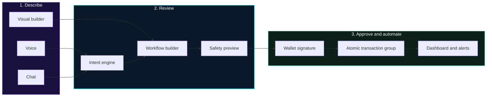
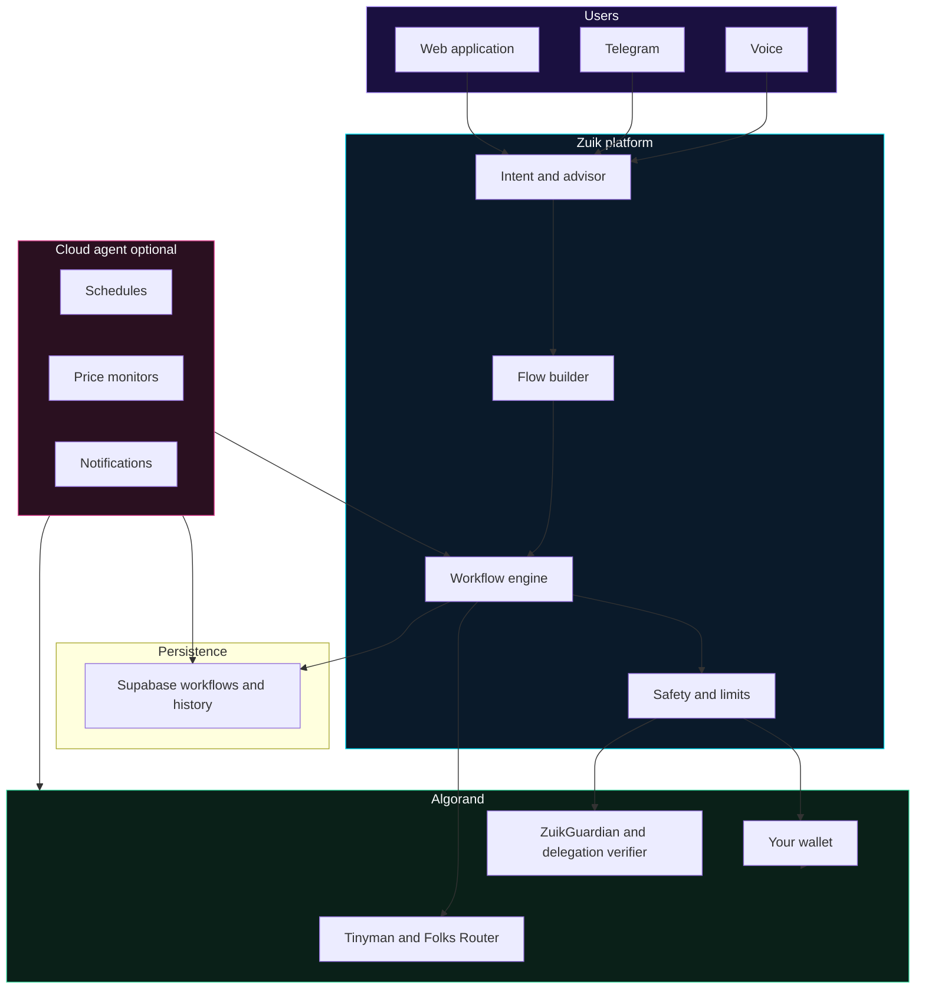
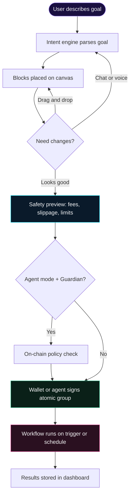
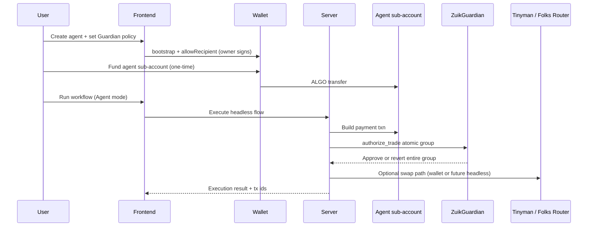

<p align="center">
  
</p>

<h1 align="center">Zuik</h1>

<p align="center">
  <strong>The First Intent-Based DeFi Automation Tool on Algorand: describe goals in plain language, review a visual workflow, sign with your wallet.</strong>
</p>

<p align="center">
  
  
  
  
</p>

<p align="center">
  Set up <strong>$X weekly dollar-cost averaging into ALGO</strong>, alert yourself when prices move, or rebalance - by voice, chat, or drag-and-drop.
</p>

<p align="center">
  <a href="#overview"><strong>Overview</strong></a>
  &nbsp;&middot;&nbsp;
  <a href="#getting-started"><strong>Get started</strong></a>
  &nbsp;&middot;&nbsp;
  <a href="#developer-setup"><strong>Run locally</strong></a>
  &nbsp;&middot;&nbsp;
  <a href="#architecture"><strong>Architecture</strong></a>
</p>

---

## Table of contents

<details open>
<summary><strong>Jump to a section</strong></summary>

**Product**

- [Overview](#overview)
- [User journey](#user-journey)
- [Capabilities and use cases](#capabilities-and-use-cases)

**Technical deep dive**

- [Architecture](#architecture)
- [Workflow creation](#workflow-creation)
- [Smart contracts](#smart-contracts)
  - [Contract interaction flow](#contract-interaction-flow)
  - [ZuikGuardian](#zuikguardian)
  - [TestNet deployment](#testnet-deployment)
- [Technology and integrations](#technology-and-integrations)

**Build and run**

- [Getting started](#getting-started)
- [Developer setup](#developer-setup)
  - [Prerequisites](#prerequisites)
  - [Clone and install](#clone-and-install)
  - [Environment configuration](#environment-configuration)
  - [Running the project](#running-the-project)
- [Development workflow](#development-workflow)

**Trust**

- [Security and trust](#security-and-trust)
- [License](#license)

</details>

---

## Overview

Most people want outcomes - steady investing, recurring payments, price alerts - not another dashboard to babysit. Zuik turns those goals into reviewable, wallet-signed workflows without scripts or manual monitoring.

Zuik is an intent-based DeFi automation platform on Algorand. You describe what you want; AI and visual tools turn that into a clear workflow you review and approve.

| Pain point | How Zuik helps |
|------------|----------------|
| Complexity across wallets, DEXs, and spreadsheets | One intent engine and visual builder for the full flow |
| Manual price monitoring and rebalancing | Scheduled triggers and condition-based automation |
| Technical barriers to scripting bots | Natural language, voice, and drag-and-drop blocks |
| Unclear fees and risk before signing | Safety preview with fee estimates and on-chain limits |
| Missed off-hours opportunities | Optional cloud agent for 24/7 schedules and alerts |

**Live on Algorand TestNet:** Guardian App `763727553` deployed and wired into Settings (policy, recipients, agent wallets, risk scoring). Headless ALGO payments run via server atomic groups. Swaps route through Tinyman on TestNet and Folks Router where available. See [docs/testing/README.md](docs/testing/README.md) for the demo validation path.

---

## User journey


```mermaid
flowchart LR
    subgraph INPUT["1. Describe"]
        V["Voice"]
        T["Chat"]
        B["Visual builder"]
    end

    subgraph ZUIK["2. Review"]
        INTENT["Intent engine"]
        FLOW["Workflow builder"]
        CHECK["Safety preview"]
    end

    subgraph EXECUTE["3. Approve and automate"]
        SIGN["Wallet signature"]
        ATOMIC["Atomic transaction group"]
        TRACK["Dashboard and alerts"]
    end

    V --> INTENT
    T --> INTENT
    B --> FLOW
    INTENT --> FLOW
    FLOW --> CHECK
    CHECK --> SIGN
    SIGN --> ATOMIC
    ATOMIC --> TRACK

    style INPUT fill:#1a1040,stroke:#a78bfa,color:#f8fafc
    style ZUIK fill:#0a1a2a,stroke:#00e5ff,color:#f8fafc
    style EXECUTE fill:#0a2018,stroke:#34d399,color:#f8fafc
```

You stay non-custodial throughout: Zuik orchestrates, your wallet signs, and multi-step flows run as atomic transaction groups on Algorand.

---

## Capabilities and use cases

| Capability | Examples |
|------------|----------|
| **Multimodal input** | Voice, chat, and a 34-block visual flow builder |
| **Non-custodial execution** | Wallet-signed transactions; assets stay in your control |
| **Atomic groups** | Multi-step trades succeed together or not at all |
| **DEX connectivity** | Tinyman direct pools and Folks Router aggregation |
| **On-chain safety** | Guardian atomic enforcement (max per trade, daily cap, allowlists, expiry) |
| **Cloud agent** | Background schedules, price monitors, and Telegram alerts |
| **Persistence** | Supabase-backed workflows and run history |
| **Trading and investing** | Weekly DCA, conditional swaps on price drops, take-profit flows |
| **Scheduled payments** | Recurring sends to any Algorand address, payroll-style batches |
| **Portfolio management** | Rebalancing, yield routing, auto-allocate incoming stablecoin deposits |
| **Monitoring** | Threshold alerts to Telegram or Discord, multi-asset watchlists |

---

## Architecture


```mermaid
graph TB
    subgraph USERS["Users"]
        WEB["Web application"]
        TG["Telegram"]
        VOICE["Voice"]
    end

    subgraph PLATFORM["Zuik platform"]
        INTENT["Intent and advisor"]
        BUILDER["Flow builder"]
        EXEC["Workflow engine"]
        SAFE["Safety and limits"]
    end

    subgraph PERSIST["Persistence"]
        DB["Supabase workflows and history"]
    end

    subgraph AGENT["Cloud agent optional"]
        SCHED["Schedules"]
        PRICE["Price monitors"]
        NOTIFY["Notifications"]
    end

    subgraph ALGORAND["Algorand"]
        WALLET["Your wallet"]
        SWAPS["Tinyman and Folks Router"]
        GUARD["ZuikGuardian and delegation verifier"]
    end

    WEB --> INTENT
    VOICE --> INTENT
    TG --> INTENT
    INTENT --> BUILDER
    BUILDER --> EXEC
    EXEC --> SAFE
    SAFE --> WALLET
    EXEC --> SWAPS
    SAFE --> GUARD
    EXEC --> DB
    AGENT --> EXEC
    AGENT --> DB
    AGENT --> ALGORAND
    WALLET --> ALGORAND

    style USERS fill:#1a1040,stroke:#a78bfa,color:#f8fafc
    style PLATFORM fill:#0a1a2a,stroke:#00e5ff,color:#f8fafc
    style AGENT fill:#2a1020,stroke:#ec4899,color:#f8fafc
    style ALGORAND fill:#0a2018,stroke:#34d399,color:#f8fafc
```

| Layer | Role |
|-------|------|
| **Experience** | Web builder, chat, voice, and Telegram as entry points |
| **Orchestration** | Ordered steps with logic, math, conditions, and multi-agent flows |
| **Safety** | Pre-sign previews, advisor context, Guardian on-chain caps, ASA risk scoring |
| **Execution** | Wallet-signed transactions and atomic groups on Algorand |
| **Persistence** | Supabase stores workflows and run history across sessions |
| **Cloud agent** | Background triggers when you opt in (Node.js server on Railway or local) |

### Repository structure

Monorepo managed with [AlgoKit](https://github.com/algorandfoundation/algokit-cli) workspace configuration (`.algokit.toml`):

| Package | Path | Role |
|---------|------|------|
| **Frontend** | `projects/Zuik-frontend` | React web app: builder, dashboard, wallet, swap execution |
| **Backend** | `projects/server` | AI proxy, market proxy, cloud agent, Telegram, voice |
| **Contracts** | `projects/Zuik-contracts` | ZuikGuardian smart contract (Algorand TypeScript / Puya) |

---

## Workflow creation

From natural language to on-chain execution, Zuik materializes intent into a reviewable flow before anything is signed.


```mermaid
flowchart TD
    START(["User describes goal"]) --> PARSE["Intent engine parses goal"]
    PARSE --> MATERIALIZE["Blocks placed on canvas"]
    MATERIALIZE --> REFINE{"Need changes?"}
    REFINE -->|"Chat or voice"| PARSE
    REFINE -->|"Drag and drop"| MATERIALIZE
    REFINE -->|"Looks good"| PREVIEW["Safety preview: fees, slippage, limits"]
    PREVIEW --> POLICY{"Agent mode + Guardian?"}
    POLICY -->|"Yes"| VERIFY["On-chain policy check"]
    POLICY -->|"No"| SIGN
    VERIFY --> SIGN["Wallet or agent signs atomic group"]
    SIGN --> RUN["Workflow runs on trigger or schedule"]
    RUN --> HISTORY["Results stored in dashboard"]

    style START fill:#1a1040,stroke:#a78bfa,color:#f8fafc
    style PREVIEW fill:#0a1a2a,stroke:#00e5ff,color:#f8fafc
    style SIGN fill:#0a2018,stroke:#34d399,color:#f8fafc
    style RUN fill:#2a1020,stroke:#ec4899,color:#f8fafc
```

Refine through chat, voice, or drag-and-drop until the canvas matches your intent. The safety preview surfaces fees and slippage before you sign.

---

## Smart contracts

Contracts are written in **Algorand TypeScript**, compiled with **Puya**, and deployed through **AlgoKit**. Generated TypeScript clients link into the frontend via `algokit project link`.

### Contract interaction flow


```mermaid
sequenceDiagram
    participant User
    participant Frontend
    participant Wallet
    participant Server
    participant Agent as Agent sub-account
    participant Guardian as ZuikGuardian
    participant DEX as Tinyman / Folks Router

    User->>Frontend: Create agent + set Guardian policy
    Frontend->>Wallet: bootstrap + allowRecipient (owner signs)
    User->>Wallet: Fund agent sub-account (one-time)
    Wallet->>Agent: ALGO transfer

    User->>Frontend: Run workflow (Agent mode)
    Frontend->>Server: Execute headless flow
    Server->>Agent: Build payment txn
    Server->>Guardian: authorize_trade atomic group
    Guardian-->>Server: Approve or revert entire group
    Server->>DEX: Optional swap path (wallet or future headless)
    Server-->>Frontend: Execution result + tx ids
```

### ZuikGuardian

On-chain **policy store** for funded agent sub-accounts. The owner registers each agent with max per trade, daily cap, expiry, execution count, and allowed assets/DEX apps. Autonomous spends use an atomic group: payment from the agent, then `authorize_trade(pay)` (or `authorize_asset_trade` for ASAs). If any assert fails, the whole group reverts.

| Method | Caller | Purpose |
|--------|--------|---------|
| `bootstrap` | Owner | Register or update agent policy in box storage |
| `allowRecipient` | Owner | Allowlist payout addresses per agent |
| `authorize_trade` | Keeper | Assert payment txn against policy (atomic with pay) |
| `authorize_asset_trade` | Keeper | Assert ASA transfer against policy |
| `emergency_stop` / `resume` | Owner | Pause or resume all enforcement |
| Readonly getters | Any | `getPolicy`, `isRecipientAllowed`, pause state |

Source: `projects/Zuik-contracts/smart_contracts/guardian/contract.algo.ts`

LogicSig delegation was removed in the June 2026 MVP pivot. Use funded agent wallets plus Guardian instead.

### TestNet deployment

| Contract | Network | Application ID | Application address | Status |
|----------|---------|----------------|---------------------|--------|
| **ZuikGuardian** | TestNet | `763727553` | `RMZRRH5YEVQCAXLSPYDUG7RTCXNJ6MHA77KGDC3DMNRHG3SYNLVW32YS2M` | Deployed (2026-05-31) |

Deployment artifact: `projects/Zuik-contracts/smart_contracts/artifacts/guardian/deployment.json`

**Configure the frontend** (see `projects/Zuik-frontend/.env.template`):

```bash
VITE_GUARDIAN_APP_ID=763727553
VITE_GUARDIAN_APP_ADDRESS=RMZRRH5YEVQCAXLSPYDUG7RTCXNJ6MHA77KGDC3DMNRHG3SYNLVW32YS2M
```

**Validate the MVP** (~0.25 ALGO on TestNet): see [docs/testing/README.md](docs/testing/README.md).

**Redeploy contracts** (LocalNet or TestNet):

```bash
cd projects/Zuik-contracts
algokit localnet start          # LocalNet only
npm run build                   # Compile TEAL and generate clients
algokit project deploy testnet  # or localnet
```

Integration tests: `npm run test:localnet` and `npm run test:testnet` in `projects/Zuik-contracts`.

---

## Technology and integrations

| Area | Technologies |
|------|--------------|
| **Frontend** | React 18, TypeScript, Vite, React Router, `@xyflow/react`, `@txnlab/use-wallet` |
| **Backend** | Node.js 20+, Express-style routing, cloud workflow runner |
| **Smart contracts** | Algorand TypeScript (Puya), AlgoKit CLI, AlgoKit Utils, generated ARC-56 clients |
| **Blockchain** | `algosdk`, Algorand atomic transaction groups, Guardian enforcement |
| **AI** | Groq (intent parsing and chat via server proxy) |
| **Database** | Supabase (workflows, execution history, delegation vault records) |
| **Voice** | Groq Whisper transcription, ElevenLabs text-to-speech (optional) |
| **Demos** | Playwright browser automation |

| Integration | Role in Zuik |
|-------------|--------------|
| **[Tinyman](https://tinyman.org/)** | Primary TestNet swap execution via `@tinymanorg/tinyman-js-sdk` |
| **[Folks Router](https://folksrouter.io/)** | Aggregated swap quotes and routes |
| **[Pera Wallet](https://perawallet.app/)** | Wallet connect via `@perawallet/connect` |
| **[Defly Wallet](https://defly.app/)** | Wallet connect via `@blockshake/defly-connect` |
| **[AlgoKit](https://github.com/algorandfoundation/algokit-cli)** | Workspace build, LocalNet, contract deploy, client generation |
| **[Nodely](https://nodely.io/)** | Free-tier TestNet algod and indexer endpoints (default in `.env.template`) |
| **[Supabase](https://supabase.com/)** | Workflow persistence, dashboard, delegation metadata |
| **[Groq](https://groq.com/)** | Server-side LLM for intent parsing (key never exposed to browser) |
| **[Telegram](https://telegram.org/)** | Bot notifications, workflow control, voice conversations via `@ZuikDeFiBot` |

Swap routing tries **Tinyman** first (on-chain pool state), then **Folks Router** when a competitive quote is available (`projects/Zuik-frontend/src/services/swapToken.ts`).

---

## Getting started

| Step | Action |
|------|--------|
| **1** | Open the Zuik application and connect a supported Algorand wallet (Pera, Defly, Exodus, and others on TestNet). |
| **2** | Open the builder. Use chat, voice, or a starter template. |
| **3** | Try a prompt like: *Every Friday, swap $X USDC to ALGO and message me on Telegram when done.* |
| **4** | Review the visual workflow, limits, and fee preview. |
| **5** | Sign once to activate. Your keys never leave your wallet. |
| **6** (optional) | Enable the cloud agent for 24/7 schedules and price watches. |

Fund TestNet wallets from the [Algorand TestNet dispenser](https://dispenser.testnet.aws.algodev.network/).

**Security habits:** start with small amounts, use Guardian caps for delegated automation, keep Telegram and API keys private.

For local development, continue to [Developer setup](#developer-setup).

---

## Developer setup

### Prerequisites

| Requirement | Notes |
|-------------|-------|
| **Node.js 20+** | Frontend and server |
| **Node.js 22+** | Smart contracts |
| **npm 9+** | Bundled with Node.js |
| **Docker** | LocalNet only |
| **AlgoKit CLI 2.5+** | Contract compile, deploy, LocalNet |

Optional keys for full functionality: [Groq](https://console.groq.com), [Supabase](https://supabase.com).

### Clone and install

```bash
git clone https://github.com/DarshanKrishna-DK/Zuik.git
cd Zuik

cd projects/Zuik-frontend && npm install
cd ../server && npm install
cd ../Zuik-contracts && npm install
```

Build everything from the repository root:

```bash
algokit project run build
```

### Environment configuration

Never commit secrets. Use `.env.local` (frontend) and `.env` (server).

**Frontend** (`projects/Zuik-frontend`):

```bash
cd projects/Zuik-frontend
cp .env.template .env.local
```

Uncomment **one** network block (TestNet, LocalNet, or MainNet). TestNet works out of the box with Nodely endpoints.

| Variable | Required | Purpose |
|----------|:--------:|---------|
| `VITE_ALGOD_SERVER`, `VITE_ALGOD_NETWORK` | Yes | Algorand node |
| `VITE_INDEXER_SERVER` | Yes | Transaction history |
| `VITE_SERVER_URL` | Optional in dev | Backend URL for production builds (dev uses Vite proxy) |
| `VITE_SUPABASE_URL`, `VITE_SUPABASE_ANON_KEY` | For persistence | Workflows and dashboard |
| `VITE_GUARDIAN_APP_ID`, `VITE_GUARDIAN_APP_ADDRESS` | For Guardian | TestNet values in [Smart contracts](#smart-contracts) or your deploy |

The Groq key lives on the **server** as `GROQ_API_KEY`, not in the frontend.

**Backend** (`projects/server`):

```bash
cd projects/server
cp .env.example .env
```

| Variable | Required | Purpose |
|----------|:--------:|---------|
| `SUPABASE_URL`, `SUPABASE_SERVICE_KEY` | Yes | Database |
| `GROQ_API_KEY` | For AI | Intent parsing |
| `CORS_ORIGIN` | Yes | Include `http://localhost:5173` (and `5174` if Vite falls back) |

See [projects/server/README.md](projects/server/README.md) for Railway deployment and Telegram webhook setup.

### Running the project

| Service | Port | URL |
|---------|------|-----|
| Frontend (Vite) | 5173 | http://localhost:5173 |
| Backend | 4021 | http://localhost:4021 |
| Voice server (development) | 3002 | http://localhost:3002 |

**Terminal 1 - Backend**

```bash
cd projects/server
# Set PORT=4021 in .env (or export PORT=4021)
npm run dev
```

**Terminal 2 - Frontend**

```bash
cd projects/Zuik-frontend
npm run dev
```

**Verify**

1. `curl http://localhost:4021/health` returns `"status": "ok"`.
2. Open http://localhost:5173 and connect a TestNet wallet (Pera, Defly, or Exodus).
3. Send a chat prompt in the builder (requires `GROQ_API_KEY` on the server).

---

## Development workflow

| Location | Command | Purpose |
|----------|---------|---------|
| `projects/Zuik-frontend` | `npm run dev` | Development server |
| `projects/Zuik-frontend` | `npm run build:strict` | Typecheck and production build |
| `projects/server` | `npm run dev` | Backend with hot reload |
| `projects/server` | `npm run agent:dev` | Cloud agent loop only |
| `projects/Zuik-contracts` | `npm run build` | Compile contracts |
| `projects/Zuik-contracts` | `npm run test:localnet` | Contract integration tests |
| Repository root | `algokit project run build` | Build frontend and contracts |

---

## Security and trust

| Principle | Commitment |
|-----------|------------|
| **Non-custodial** | Zuik cannot move funds without your wallet signature |
| **Transparent workflows** | Every step visible before approval |
| **On-chain limits** | Guardian `authorize_trade` caps automated agent spending |
| **Atomic safety** | Multi-step actions avoid partial execution |
| **You own your keys** | Export, rotate, and disconnect wallets at any time |

Zuik provides tooling, not investment advice. Only automate amounts you can afford to risk.

---

## License

Zuik is open source under the [MIT License](LICENSE).

---

<p align="center">
  <strong>DeFi automation on Algorand - describe it, review it, sign it, forget the busywork.</strong>
</p>
