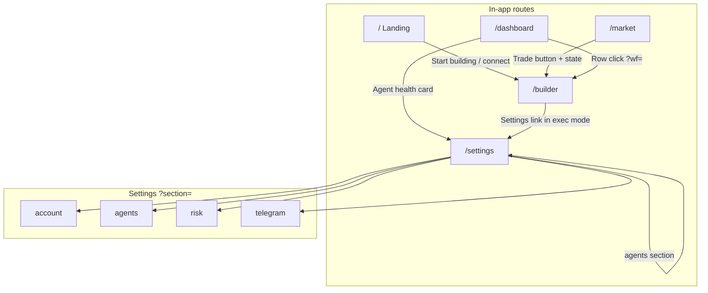

# ZUIK Navigation Map

Routes, deep links, query parameters, and voice phrase mappings for programmatic navigation. Use React Router `navigate(path)` or `<Link to={path}>` patterns from the voice action executor.

**Base URL (dev):** `http://localhost:5173`  
**Router:** React Router v6 in `AppShell.tsx`

---

## Primary routes

| Route | Label | Nav link text | Requires wallet |
|-------|-------|---------------|-----------------|
| `/` | Landing | (brand logo only) | No |
| `/builder` | Builder | Builder | No |
| `/market` | Market | Market | No |
| `/dashboard` | Dashboard | Dashboard | Yes (for data) |
| `/settings` | Settings | Settings | Partial |

### Navbar link selectors

Navbar links are React Router `<Link>` elements with visible text matching the label:

```javascript
// Playwright-style
page.getByRole('link', { name: 'Builder' })
page.getByRole('link', { name: 'Market' })
page.getByRole('link', { name: 'Dashboard' })
page.getByRole('link', { name: 'Settings' })
```

CSS: `.zuik-nav-link` with `.active` when current path matches.

**Note:** Navbar is **not rendered** on `/`. From landing, navigate by URL or CTA.

---

## Settings deep links

| URL | Section | Nav testid |
|-----|---------|------------|
| `/settings` | Account (default) | `settings-nav-account` |
| `/settings?section=account` | Account | `settings-nav-account` |
| `/settings?section=agents` | Agent Management | `settings-nav-agents` |
| `/settings?section=risk` | Risk management | `settings-nav-risk` |
| `/settings?section=telegram` | Telegram | `settings-nav-telegram` |

### Legacy aliases (auto-redirect to agents)

These query values are rewritten to `section=agents` in `Settings.tsx`:

| Legacy URL | Resolves to |
|------------|-------------|
| `/settings?section=guardian` | Agent Management |
| `/settings?section=agent-wallets` | Agent Management |
| `/settings?section=automation` | Agent Management |

Voice assistant should prefer canonical `?section=agents` but legacy URLs still work.

### Cross-page settings links

| Source | Target |
|--------|--------|
| Dashboard agent health card | `/settings?section=agents` |
| ExecutionModeSelector "Settings" link | `/settings?section=agents` |
| Dashboard (implicit) | User may say "fix agent in settings" |

---

## Builder deep links

| URL | Purpose |
|-----|---------|
| `/builder` | New or restored local workflow |
| `/builder?wf={uuid}` | Load cloud workflow by Supabase ID |

### React Router state (not in URL)

Navigate programmatically with state for Market → Builder handoff:

```javascript
navigate('/builder', {
  state: {
    prefillIntent: 'Swap 50 USDC to ALGO',
    fromAssetId: 10458941, // optional
  },
})
```

| State key | Set by | Effect |
|-----------|--------|--------|
| `prefillIntent` | QuickSwapButton, voice executor | Opens AI chat with message |
| `fromAssetId` | Market | Asset context for intent |

After apply, Builder clears state with `replace: true` to avoid re-trigger on refresh.

---

## Market deep links

| URL | Purpose |
|-----|---------|
| `/market` | Default view (first top mover) |
| `/market?asset=0` | ALGO |
| `/market?asset=10458941` | ASA by numeric ID (e.g. testnet USDC) |
| `/market?asset=cg:algorand` | CoinGecko-style identifier |

Updating asset param uses `setSearchParams({ asset: String(token.id) }, { replace: true })`.

---

## External links (open new tab)

| Destination | Pattern |
|-------------|---------|
| Lora account | `{explorerBase}/account/{address}` |
| Lora transaction | `{explorerBase}/transaction/{txId}` |
| Telegram bot | `https://t.me/{VITE_TELEGRAM_BOT_USERNAME}` |

Explorer base by network:

| Network | Base |
|---------|------|
| testnet | `https://lora.algokit.io/testnet` |
| mainnet | `https://lora.algokit.io/mainnet` |
| localnet | `https://lora.algokit.io/localnet` |

Voice should say "opening explorer" rather than navigating SPA away.

---

## Voice phrase → navigation matrix

### Global navigation

| User says (examples) | Action |
|----------------------|--------|
| "Go home" / "Landing page" | `/` |
| "Open builder" / "Workflow editor" | `/builder` |
| "Open market" / "Token explorer" | `/market` |
| "Dashboard" / "My workflows" | `/dashboard` |
| "Settings" / "Preferences" | `/settings` |
| "Connect wallet" | Open modal via `nav-connect-wallet` (stay on page) |

### Settings navigation

| User says | Action |
|-----------|--------|
| "Account settings" | `/settings?section=account` |
| "Agent settings" / "Manage agents" / "Guardian" | `/settings?section=agents` |
| "Risk settings" / "Risk tolerance" | `/settings?section=risk` |
| "Telegram settings" / "Notifications" | `/settings?section=telegram` |

### Builder navigation

| User says | Action |
|-----------|--------|
| "Open workflow {name}" | `/dashboard` → find row → `/builder?wf={id}` OR search dashboard first |
| "New workflow" | `/builder` (clear wf param - may need Clear canvas) |
| "Open my last workflow" | Load from dashboard list or local storage |

### Market navigation

| User says | Action |
|-----------|--------|
| "Show ALGO price" | `/market?asset=0` |
| "Show token {id}" | `/market?asset={id}` |

---

## Navigation flow diagram



---

## Programmatic navigation (TypeScript)

Voice action executor should use the same router instance as the app:

```typescript
import { useNavigate } from 'react-router-dom'

// Simple page
navigate('/dashboard')

// Settings section
navigate('/settings?section=agents')

// Builder with workflow
navigate(`/builder?wf=${workflowId}`)

// Builder with AI prefill
navigate('/builder', { state: { prefillIntent: 'Swap 10 USDC to ALGO' } })

// Market token
navigate('/market?asset=10458941')
```

### Replace vs push

Use `{ replace: true }` when fixing redirects (Settings section sync) to avoid back-button loops. Builder uses replace when clearing navigation state after prefill.

---

## Wallet-gated navigation

| Target | Disconnected behavior |
|--------|----------------------|
| `/builder` from landing CTA | Opens wallet modal, then redirects on connect |
| `/dashboard` | Shows connect prompt (no auto modal) |
| Agent fund / Guardian txs | Buttons disabled or error until connected |

Voice flow: detect `.zuik-connect-prompt` or missing `activeAddress` → offer "Connect wallet first".

---

## URL parameter reference (quick lookup)

| Page | Param | Type | Example |
|------|-------|------|---------|
| Settings | `section` | enum | `agents` |
| Builder | `wf` | UUID string | `a1b2c3d4-...` |
| Market | `asset` | number or string | `0`, `10458941`, `cg:algorand` |

---

## Breadcrumb and back navigation

SPA has no hierarchical breadcrumbs except Market (`MarketBreadcrumb`). Voice "go back" should use browser history or explicit route:

- From builder to dashboard: "Show dashboard" → `/dashboard`
- From settings section to another: update `?section=` only (no full page reload)

---

## E2E-verified paths

From Playwright specs (`e2e/tests/`):

| Test | Path |
|------|------|
| Builder UI | `/builder` - expects `.react-flow`, `execution-mode-selector`, `builder-ai-assistant` |
| Market UI | `/market` - expects `market-quick-swap` |
| Settings | `/settings` - nav to agents, risk slider persistence |
| Guardian legacy | `/settings?section=guardian` → shows `agent-management` |
| Navbar | From `/market`, link "Builder" → `/builder` |

---

## Anti-patterns

| Avoid | Why |
|-------|-----|
| Full page reload for internal routes | Loses React state, wallet session |
| `window.location` for settings section | Use search params API instead |
| Navigating to `/builder?wf=` with invalid UUID | Shows error/empty - validate from dashboard list first |
| Assuming navbar on landing | Use direct URL navigation |
