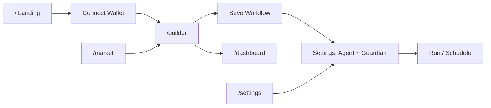

# ZUIK Platform Blueprint

Knowledge base for the platform-wide voice assistant. Describes architecture, pages, data flow, APIs, and control surfaces. Keep in sync with `src/AppShell.tsx`, `src/pages/*`, and `projects/server/index.ts`.

**Last verified:** 2026-06-09  
**Frontend root:** `projects/Zuik-frontend/`  
**Server root:** `projects/server/` (default port `4021`)

---

## 1. Product overview

ZUIK is a non-custodial Algorand workflow builder. Users connect a wallet (Pera, Defly, Lute, etc. via `@txnlab/use-wallet`), design visual automation flows on a React Flow canvas, and run them manually, on a schedule, or through a funded **agent wallet** guarded by the **ZuikGuardian** smart contract.

Core capabilities:

| Capability | Where it lives |
|------------|----------------|
| Visual workflow builder | `/builder` |
| AI intent → canvas | Builder toolbar **AI** button → `ChatPanel` → Groq via `/api/ai/chat` |
| Market research | `/market` (Vestige + CoinGecko data) |
| Workflow dashboard | `/dashboard` (Supabase-backed) |
| Wallet, agents, Guardian, risk, Telegram | `/settings` |
| Headless agent execution | `projects/server` + Supabase schedules |
| On-chain policy limits | `ZuikGuardian` contract (`VITE_GUARDIAN_APP_ID`) |

---

## 2. Application shell and routing

**Entry:** `src/App.tsx` → `AppShell.tsx`

```
zuik-app
├── zuik-main
│   ├── Navbar (hidden on landing `/`)
│   ├── ErrorBoundary → Suspense → Routes
│   └── ConnectWallet modal (global)
└── DemoAutoConnect (dev/demo)
```

### Routes (React Router v6)

| Path | Component | Navbar | Wallet required |
|------|-----------|--------|-----------------|
| `/` | `Landing` | No | No (Connect prompts redirect) |
| `/builder` | `Builder` | Yes | No (signing required for on-chain actions) |
| `/market` | `MarketExplorer` | Yes | No |
| `/dashboard` | `Dashboard` | Yes | Yes (shows connect prompt) |
| `/settings` | `Settings` | Yes | Partial (some sections need wallet) |

**Lazy loading:** All page components except shell are `lazy()` imported.

**Wallet redirect pattern:** Landing "Start building" calls `connectAndRedirect('/builder')` - opens wallet modal if disconnected, then navigates.

---

## 3. Global layout components

### Navbar (`src/components/layout/Navbar.tsx`)

- **Brand link:** `/` (logo + "ZUIK")
- **Nav links:** Builder, Market, Dashboard, Settings (class `zuik-nav-link`, active when `location.pathname` matches)
- **Wallet area:**
  - Disconnected: `data-testid="nav-connect-wallet"` → opens ConnectWallet modal
  - Connected: dropdown with ALGO/ASA balances, "Manage Wallet"

### ConnectWallet (`src/components/ConnectWallet.tsx`)

Modal for wallet selection and account display. Uses `data-test-id="close-wallet-modal"` (note: hyphenated attribute, not `data-testid`).

Supported wallets come from `@txnlab/use-wallet` provider configuration in `App.tsx`.

---

## 4. Page summaries

### Landing (`/`)

Marketing page with hero, feature grid, stats, CTA. Key actions:

- Connect wallet (opens modal)
- **Start building** → `data-testid="landing-start-building"` → `/builder` (with wallet gate)

No app navbar on landing; use in-page nav or direct URL for other routes.

### Builder (`/builder`)

Primary workflow editor. Layout:

```
[ Sidebar: block palette ] | [ Canvas toolbar + React Flow + overlays ]
```

**Overlays (toggle panels):** ChatPanel (AI), TemplateGallery, TransactionPanel (test run), SchedulePanel, ExecutionLog, payroll panel (employee-payroll template only).

**Query params:**

| Param | Effect |
|-------|--------|
| `?wf={uuid}` | Load workflow from Supabase (or local fallback) |
| (none) | Restore from localStorage / empty canvas |

**Navigation state (React Router `location.state`):**

| State key | Effect |
|-----------|--------|
| `prefillIntent` | Opens AI chat with prefilled message (used by Market quick swap) |
| `fromAssetId` | Passed from market for asset context |

**Execution modes** (`lib/executionMode.ts`):

- `user` - wallet signs each transaction
- `agent` - server agent wallet signs ALGO `send-payment` under Guardian limits

Agent mode incompatible with blocks: `swap-token`, `opt-in-asa`, `create-asa`, `call-contract`.

**Persistence:**

- Local: `flowSerializer` → localStorage
- Cloud: Supabase `workflows` table when `VITE_SUPABASE_*` configured
- Viewport: `sessionStorage` key `zuik_builder_viewport`

### Market (`/market`)

Token explorer with charts, stats, fear/greed, buy/sell pressure.

**Query params:**

| Param | Example | Effect |
|-------|---------|--------|
| `asset` | `?asset=10458941` or `?asset=cg:algorand` | Select token |

**Quick swap:** `market-trade-button` navigates to `/builder` with `state.prefillIntent` like `Swap 50 USDC to ALGO`.

### Dashboard (`/dashboard`)

Requires connected wallet + Supabase. Shows:

- Agent fleet health card → links to `/settings?section=agents` (`dash-agent-health`)
- Stats: workflows, executions, success rate, fees
- Charts: executions over time, status pie
- Workflow list: search, open (`/builder?wf=id`), activate/deactivate, duplicate, delete
- Recent executions table with Lora explorer links

Realtime updates via Supabase channel `dashboard-changes`.

### Settings (`/settings`)

Section driven by `?section=` query param. Valid sections: `account`, `agents`, `risk`, `telegram`.

**Legacy redirects** (parsed in `Settings.tsx`):

- `agent-wallets`, `automation`, `guardian` → `agents`

Sidebar nav uses `data-testid="settings-nav-{id}"`.

---

## 5. Workflow block system

**Registry:** `src/lib/blockRegistry.ts`

Categories: `trigger`, `action`, `logic`, `notification`, `defi`.

### Block IDs (canvas `data.blockId`)

| Category | Block IDs |
|----------|-----------|
| Triggers | `timer-loop`, `webhook-receiver`, `wallet-event`, `telegram-trigger` |
| Actions | `swap-token`, `send-payment`, `ai-agent`, `opt-in-asa`, `create-asa`, `call-contract` |
| Logic | `comparator`, `delay`, `math-op`, `filter`, `rate-limiter`, `variable-set`, `merge_gate`, `fork`, `join`, `spawn_agent`, `event_trigger`, `event_emit`, `watchdog`, `constant`, `merge`, `transform-data`, `webhook-action`, `log-debug` |
| Notifications | `send-telegram`, `send-discord`, `browser-notify` |
| DeFi | `price-monitor`, `pool-info`, `portfolio-balance`, `get-quote` |

Blocks are dragged from sidebar (`application/zuik-block` drag payload) onto React Flow canvas as `generic` nodes.

### Starter templates (`templateService.ts`)

| Template ID | Name |
|-------------|------|
| `dca-bot` | DCA Bot |
| `price-alert` | Price Alert |
| `treasury-split` | Treasury Split |
| `asa-airdrop` | ASA Airdrop |
| `swap-and-notify` | Swap & Notify |
| `recurring-payment` | Recurring Payment |
| `employee-payroll` | Send Money to Employees |
| `whale-alert` | Whale Alert |
| `stop-loss` | Stop-Loss Guard |
| `portfolio-rebalance` | Portfolio Rebalance |

---

## 6. AI and voice services

### Intent parser / builder chat

- **Client:** `src/services/intentParser.ts`
- **Endpoint:** `/api/ai/chat` (Vite proxy in dev, or `VITE_SERVER_URL/api/ai/chat`)
- **Model:** `VITE_GROQ_MODEL` (default `llama-3.3-70b-versatile`)
- **UI:** `ChatPanel` modes: `builder` (workflow generation) and `advisor` (trading guidance)

### Voice pipeline (existing, for global assistant integration)

- **Client:** `src/services/voiceService.ts`
- **Base:** `VITE_VOICE_SERVER_URL` or dev proxy `/api/voice`
- **Routes:** `/health`, `/transcribe`, `/synthesize`, `/voices`, `/detect-language`

---

## 7. Backend API surface

**Base URL:** `VITE_SERVER_URL` (default `http://localhost:4021`)

| Route | Purpose |
|-------|---------|
| `GET /health` | Server health |
| `POST /telegram/webhook` | Telegram bot updates |
| `POST /webhook/:workflowId` | External webhook trigger for active workflow |
| `POST /api/workflows/execute` | Headless agent workflow run |
| `/api/ai/*` | Groq chat proxy |
| `/api/market/*` | Market data proxy (Vestige, etc.) |
| `/api/voice/*` | STT/TTS (inline in production) |
| `/api/x402/*` | Premium x402-gated APIs |
| `/api/agent-wallets/*` | Agent registration, balance, send-payment |
| `/api/agent-management/*` | Policy templates, overview, bindings, sync |

### Agent wallet API (`/api/agent-wallets`)

| Method | Path | Purpose |
|--------|------|---------|
| POST | `/register` | Create agent key for workflow |
| GET | `/:agentAddress/balance` | Balance + key status |
| GET | `/by-wallet/:ownerAddress` | List agents for owner |
| PATCH | `/:agentAddress` | Update display name |
| POST | `/:agentAddress/send-payment` | Guardian-gated payment |
| DELETE | `/:agentAddress` | Archive agent |

### Agent management API (`/api/agent-management`)

| Method | Path | Purpose |
|--------|------|---------|
| GET | `/policy-templates` | List templates |
| POST | `/policy-templates` | Create custom template |
| GET | `/overview/:ownerAddress` | Agent fleet overview |
| POST | `/policy-bindings` | Bind policy to agent |
| POST | `/policy-sync/:agentAddress` | Sync on-chain policy state |
| PATCH | `/agents/:agentAddress` | Update agent metadata |

---

## 8. Data stores and external services

| Store | Usage |
|-------|--------|
| Supabase | Workflows, executions, schedules, telegram_links, agent tables |
| localStorage | Execution mode per workflow, risk slider, Telegram chat ID, flow backup |
| sessionStorage | Builder viewport |
| Algorand algod/indexer | Balances, transactions, Guardian reads |
| Vestige API | Market token data (via server proxy) |
| CoinGecko | ALGO price, OHLC, fear/greed adjunct |
| Groq | LLM intent parsing |
| ElevenLabs (server) | TTS for voice pipeline |

### Key environment variables

| Variable | Role |
|----------|------|
| `VITE_ALGOD_NETWORK` | `testnet` / `mainnet` / `localnet` |
| `VITE_GUARDIAN_APP_ID` | Guardian contract app ID |
| `VITE_SERVER_URL` | Backend base URL |
| `VITE_SUPABASE_URL` / `VITE_SUPABASE_ANON_KEY` | Cloud sync |
| `VITE_GROQ_MODEL` | LLM model name |
| `VITE_TELEGRAM_BOT_USERNAME` | Telegram settings display |

---

## 9. Guardian and agent model

1. User creates **agent wallet** (per workflow or via Settings wizard).
2. User **funds** agent with ALGO from main wallet.
3. User registers **Guardian policy** on-chain (max per trade, daily cap, daily executions, expiry).
4. Server holds agent signing key; payments go through Guardian enforcement.
5. **Emergency stop** pauses all agent payments globally for the owner.

Risk management (`/settings?section=risk`) sets max ASA risk score (0-100) in localStorage - used before swaps and Guardian ASA registration.

---

## 10. Voice assistant integration points

Recommended control layers (Phase 3+):

1. **Navigation** - React Router `navigate()` with paths from `navigation-map.md`
2. **Clicks** - `document.querySelector('[data-testid="..."]')` per `component-registry.md`
3. **Forms** - Native input events on labeled fields; risk slider via `risk-slider`
4. **Builder AI** - Toggle `builder-ai-assistant`, fill `chat-input`, click `chat-send`
5. **Workflow ops** - Deep link `/builder?wf=`, toolbar Run/Stop via class selectors
6. **State queries** - Read DOM text from dashboard stats, agent cards, wallet dropdown
7. **Transactions** - Voice prepares; user signs in wallet (never auto-sign)

### Context files (this directory)

| File | Purpose |
|------|---------|
| `platform-blueprint.md` | This document - architecture and systems |
| `page-capabilities.md` | Per-page actions and prerequisites |
| `navigation-map.md` | Routes, deep links, voice phrases |
| `component-registry.md` | testids, selectors, interaction patterns |
| `conversations/` | Runtime conversation history MD files |

---

## 11. User journey map (voice-relevant)



Typical voice commands mapped to journeys:

- "Hey Zuik, open the builder" → `/builder`
- "Create a DCA workflow" → `/builder` + open AI + intent template
- "Fund my agent with 2 ALGO" → `/settings?section=agents` + fund flow
- "Set risk tolerance to 50" → `/settings?section=risk` + slider
- "Show my dashboard" → `/dashboard`
- "Swap USDC to ALGO" → `/market` or builder AI with swap intent

---

## 12. Files to watch when updating this blueprint

| Area | Primary files |
|------|----------------|
| Routes | `src/AppShell.tsx` |
| Settings sections | `src/pages/Settings.tsx`, `src/components/settings/types.ts` |
| Builder toolbar | `src/pages/Builder.tsx` |
| Blocks | `src/lib/blockRegistry.ts` |
| Execution | `src/lib/executionMode.ts`, `src/lib/runAgent.ts` |
| Agents | `src/components/settings/AgentManagement.tsx` |
| Server | `projects/server/index.ts` |
| E2E contracts | `e2e/tests/*.spec.ts`, `e2e/fixtures/constants.ts` |
